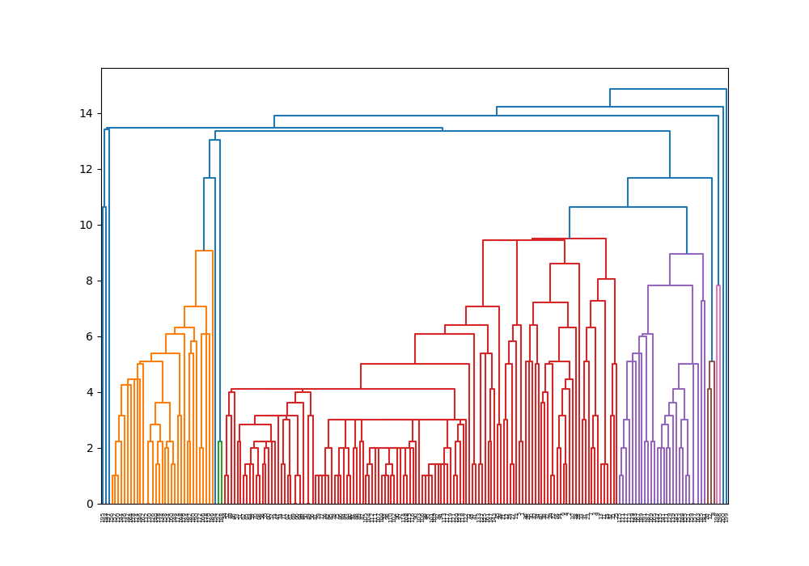
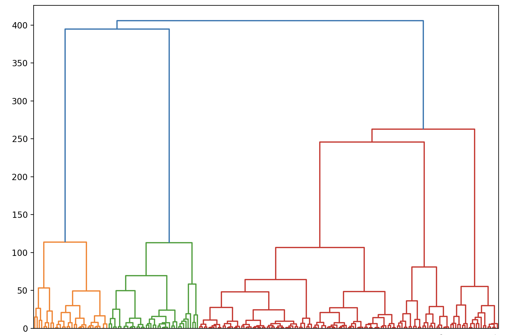
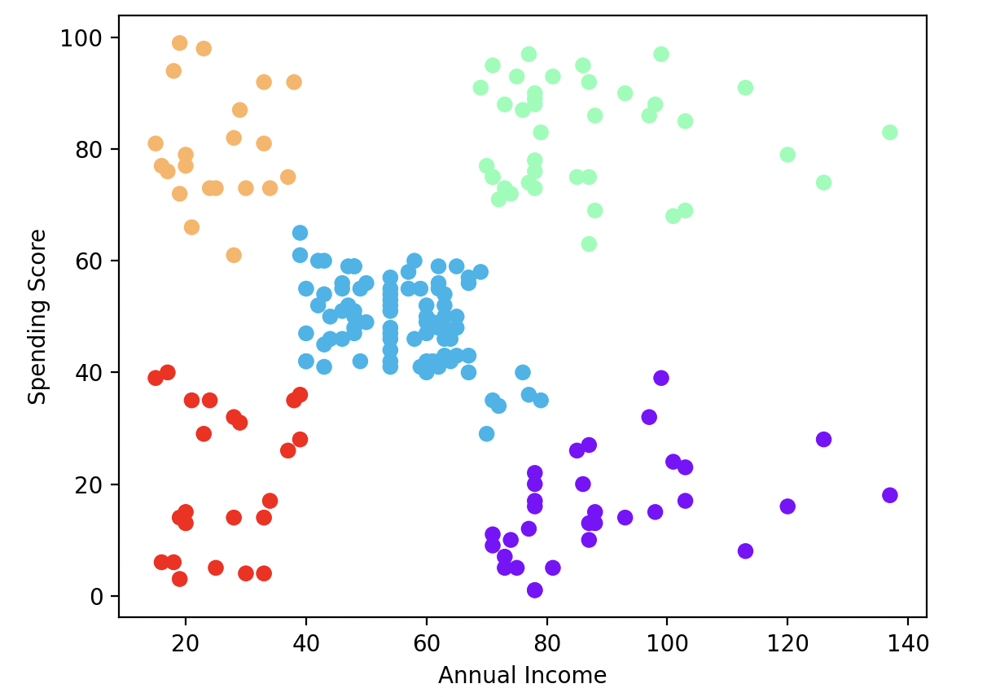

# Questions

## 1. How many clusters do you have? Explain your answer

5 clusters

## 2. The dendograms and clusters

## 3. Conclusion

It looks like people having a smaller income spends as much as people having a higher income (If we assume that the average annual income ≈ 50, people having an annual income between 40 and 70 have a lower spending score)
